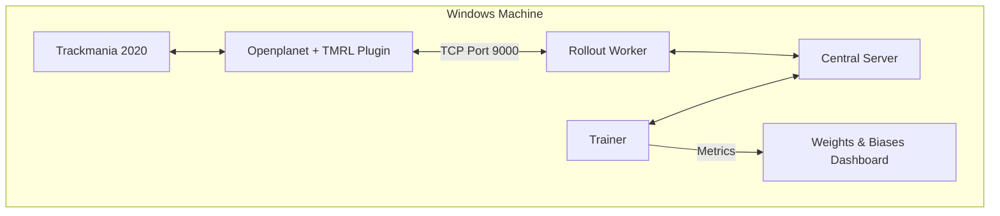

# Trackmania 2020 Reinforcement Learning Agent (TMRL - LIDAR Mode)

This project trains a Reinforcement Learning agent to drive autonomously in **Trackmania 2020**, using the **TMRL** framework in **LIDAR mode**. The agent observes a 1D distance vector instead of raw screenshots, which allows training with a lightweight MLP instead of a heavy CNN.

---

## 1. Architecture Overview

The system is composed of four cooperating processes, all running on the same Windows machine.

| Component | Role |
| :--- | :--- |
| **Trackmania 2020 + Openplanet** | Runs the game and exposes telemetry (LIDAR, speed) through the TMRL plugin. It also receives virtual gamepad inputs from the agent. |
| **Central Server** | Acts as the communication hub. Forwards experiences from the Worker to the Trainer, and forwards updated weights from the Trainer to the Worker. |
| **Trainer** | Trains the SAC (Soft Actor-Critic) policy on the collected experiences and periodically checkpoints the model to disk. |
| **Rollout Worker** | Connects to Openplanet (port 9000), drives the car in real time using the current policy, and sends the collected observations back to the Server. |



---

## 2. Prerequisites

Before starting a training session, make sure the following conditions are met.

| Requirement | Details |
| :--- | :--- |
| **Trackmania 2020** | Must be installed and **already running**, with a track loaded, before starting the Worker. |
| **Openplanet plugin** | The TMRL plugin must be loaded in-game. Check by pressing `F3` and confirming no errors appear under `Developer > Log`. |
| **Python environment** | TMRL and its dependencies must already be installed (`tmrl`, `torch`, `wandb`). |
| **Weights & Biases account (WANDB)** | Required for logging training metrics. A free account and an API key are sufficient. |
| **GPU (recommended)** | An NVIDIA GPU with CUDA support significantly speeds up training, though it is not strictly mandatory in LIDAR mode. |

---

## 3. Configuration (`config.json`)

The configuration file is located at:

```
C:\Users\<YourUsername>\TmrlData\config\config.json
```

The table below lists the settings that must be reviewed or edited before training.

| Key | Recommended Value | Purpose |
| :--- | :--- | :--- |
| `RTGYM_INTERFACE` | `"TM20LIDAR"` | Selects the lightweight LIDAR-based interface instead of the pixel-based one. |
| `RUN_NAME` | e.g. `"TMRL_LIDAR_TEST_6"` | Unique identifier for the current run. Must be changed for every new training session, otherwise TMRL will attempt to resume from an existing checkpoint. |
| `IMG_HIST_LEN` | `4` | Number of past LIDAR readings kept in the observation, used by the MLP to infer speed and acceleration. |
| `CUDA_TRAINING` | `true` | Enables GPU-accelerated training on the Trainer side. |
| `CUDA_INFERENCE` | `false` | Keeps inference on CPU for the Rollout Worker, which is usually sufficient in LIDAR mode. |
| `WANDB_PROJECT` | your project name | The Weights & Biases project under which the run will be logged. |
| `WANDB_ENTITY` | your W&B username/team | The W&B account (entity) that owns the project. Check it at `wandb.ai/settings`. |
| `WANDB_KEY` | your W&B API key | Authentication key for logging metrics to your own account. |

> **Note.** Do not commit `config.json` to version control if it contains your personal `WANDB_KEY`.

---

## 4. Running the Project

Both starting and stopping the project are handled through two dedicated scripts, which wrap the individual TMRL commands described in Section 1.

| Action | Command | Notes |
| :--- | :--- | :--- |
| **Start** | `./initialize {Account_name}` | `$1` is the name of the currently active user folder inside `Users` (e.g. `Lorenzo`). Trackmania must already be open, with a track loaded, before running this command. |
| **Shutdown** | `./shutdown` | Stops the Rollout Worker, the Trainer, and the Central Server in the correct order, avoiding corrupted checkpoints and orphaned connections. |

### What `./initialize` Does

1. Verifies that the Trackmania process is currently running.
2. Updates `RUN_NAME` in `config.json` for the new session.
3. Starts the Central Server.
4. Starts the Trainer (with W&B logging enabled).
5. Starts the Rollout Worker.

After the Worker starts, click once inside the Trackmania window so that TMRL can take control of the inputs. The car should start driving autonomously within a few seconds.

### What `./shutdown` Does

1. Stops the Rollout Worker.
2. Stops the Trainer.
3. Stops the Central Server.

> **Warning.** Always stop the Trainer before the Central Server. Stopping the Server first can interrupt an in-progress checkpoint write and corrupt the saved weights. Use `./shutdown` rather than closing the terminal windows manually, to guarantee this order is respected.

### Monitoring

Training metrics are logged to Weights & Biases at the end of every epoch. Open your project dashboard at:

```
https://wandb.ai/<WANDB_ENTITY>/<WANDB_PROJECT>
```

---